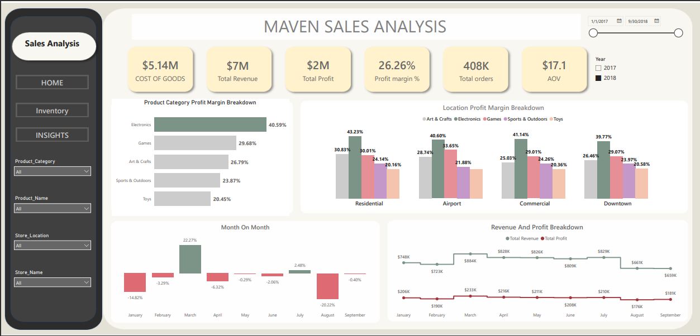
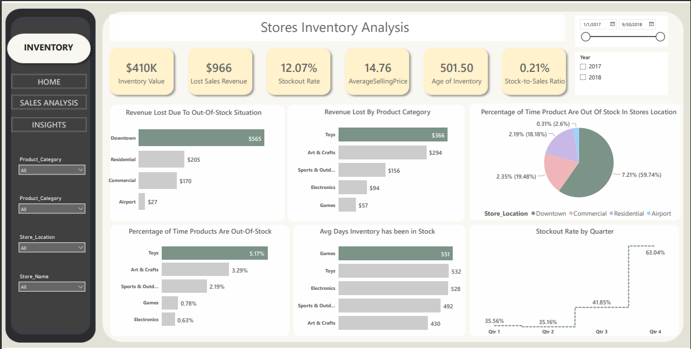

# Maven-Toys-Analysis

# Introduction
Sales and inventory data pertain to a fictional chain of toy stores located in Mexico named Maven Toys. This data encompasses details regarding products, stores, daily transactions, and the current inventory levels at each store location.
# Recommedation Analysis

1. Which product categories drive the biggest profits? Is this the same across store locations?
2. Can you find any seasonal trends or patterns in the sales data?
3. Are sales being lost with out-of-stock products at certain locations?
4. How much money is tied up in inventory at the toy stores? How long will it last?

# Sales Analysis PowerBI Dashboard

# Inventory Analysis PowerBi Dashboard

# Insight

## Which product categories drive the biggest profits? Is this the same across store locations?
### Product Category Profitability:

The analysis indicates that the product category contributing the most to actual profit is Electronics, boasting a significant profit margin of 44.61%. Following closely is the Games category with a substantial contribution of 30.33%. Notably, this trend remains consistent across all locations.

Electronics Profit Margins by Location:
Airport: 45.78%
Commercial: 45.33%
Residential: 45.76%
Downtown: 43.74%
This underscores the strong performance of Electronics, particularly in airport locations, where it achieves the highest profit margin.

# Can you find any seasonal trends or patterns in the sales data?
### Revenue and Profit Highlights:

In December, the business experienced a peak in revenue exceeding $877k, accompanied by a notable profit of $246k in the year 2017.
Contrastingly, in 2018, March emerged as the most revenue-generating month, surpassing $884k, resulting in a commendable profit of over $232k.
Seasonal Trends:

Despite the revenue and profit variations in different months, the analysis suggests that there is no evident seasonal pattern. This lack of distinct seasonal trends implies that the business's performance is not significantly influenced by specific times of the year.

## Conclusion:

The robust performance of Electronics, coupled with consistent profitability across locations, positions it as a key driver of the business's success. The absence of clear seasonal trends indicates a stable and resilient operation, allowing stakeholders to strategize effectively and capitalize on the strengths identified in product categories and revenue generation patterns. This comprehensive analysis provides a solid foundation for making informed decisions to further optimize profitability and overall business performance.

# Are sales being lost with out-of-stock products at certain locations?
#  How much money is tied up in inventory at the toy stores? How long will it last?

### Inventory Performance and Lost Revenue Analysis

#### Total Inventory Value:
The total inventory value stands at $410K, reflecting the financial investment in the available stock.
#### Lost Revenue Due to Stockouts:
A significant revenue loss of $966 is attributed to out-of-stock situations, indicating potential areas for improvement in inventory management.
#### Location-Specific Lost Revenue:
The Download location experienced the highest lost revenue, totaling $966, while the Airport location incurred the least loss, amounting to $27.
#### Product Category Impact on Lost Revenue:
Toys emerged as the product category causing the most substantial lost revenue, accounting for $366. In contrast, Games had the least impact, resulting in $57 of lost revenue.
#### Percentage of Time Products are Out of Stock by Location:
Download location had the highest percentage of time products were out of stock, reaching 7.21%.
The Airport location demonstrated efficient stock management, with the lowest percentage of time products out of stock at 0.31%.
#### Product Category Impact on Stockouts:
Toys exhibited the highest percentage of time products were out of stock at 3.39%, indicating potential challenges in inventory replenishment.
Electronics showed the least impact on stockouts, with only 0.63% of the time products were unavailable.

# RECOMMENDATIONS
### Profitability Insights:

### Optimize Electronics and Games:
Allocate marketing resources and promotional efforts to maximize sales and profitability in the Electronics and Games categories, given their high-profit margins.
Strategic Toy Category Management:

### Initiate a thorough review of the Toys category, exploring opportunities to enhance profit margins. Evaluate pricing strategies, cost optimizations, or potential product adjustments.
Consistent Profitability Across Locations:

### Leverage the consistent profit margins observed across all locations by implementing standardized operational and marketing strategies, ensuring a cohesive and efficient approach.
